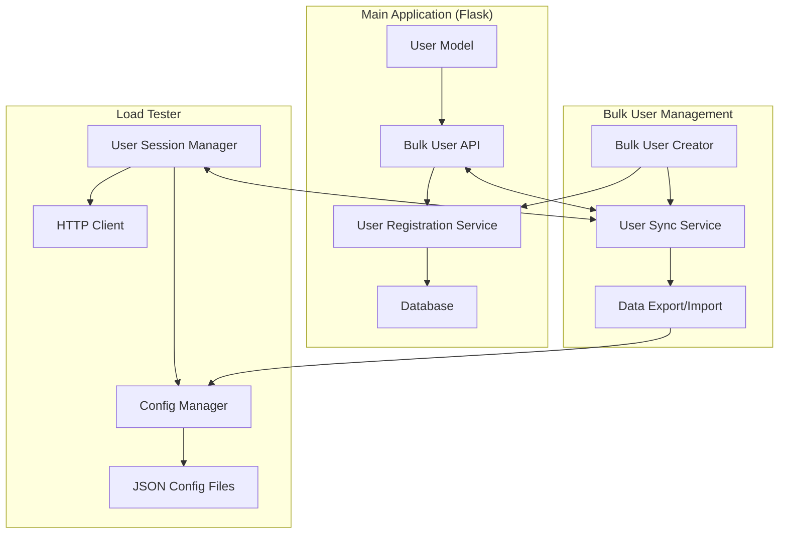

# 設計書

## 概要

複数ユーザーでの負荷テストを効率化するため、ユーザーの一括登録機能とアプリケーション・Load Tester間でのユーザーデータ同期機能を設計する。既存のFlask ECアプリケーションとLoad Testerシステムを拡張し、大規模なテストシナリオに対応する。

## アーキテクチャ

### システム構成図



### データフロー

1. **一括ユーザー作成**: Bulk User Creator → User Registration Service → Database
2. **データエクスポート**: Main Application → User Sync Service → JSON Export
3. **データインポート**: JSON Import → Load Tester Config → User Session Manager
4. **同期**: User Sync Service ↔ Main Application ↔ Load Tester

## コンポーネントと インターフェース

### 1. Bulk User Creator (Main Application側)

**責任**: 大量のテストユーザーを効率的に作成

**主要機能**:
- バッチでのユーザー作成（最大1000ユーザー）
- ユニークなユーザー名・メール生成
- テストユーザーのメタデータ管理
- 作成進捗の追跡とエラーハンドリング

**インターフェース**:
```python
class BulkUserCreator:
    def create_bulk_users(self, count: int, config: UserCreationConfig) -> BulkCreationResult
    def generate_unique_credentials(self, count: int, pattern: str) -> List[UserCredentials]
    def cleanup_test_users(self, batch_id: str) -> CleanupResult
```

### 2. User Sync Service

**責任**: アプリケーション間でのユーザーデータ同期

**主要機能**:
- Main ApplicationからのユーザーデータエクスポートAPI
- Load Tester設定ファイルへのインポート
- 双方向同期とデータ整合性チェック
- 同期ログとエラー追跡

**インターフェース**:
```python
class UserSyncService:
    def export_users_from_app(self, filter_criteria: dict) -> UserExportData
    def import_users_to_load_tester(self, user_data: UserExportData) -> SyncResult
    def sync_bidirectional(self) -> SyncResult
    def validate_sync_integrity(self) -> ValidationResult
```

### 3. Enhanced User Session Manager (Load Tester側)

**責任**: 既存のUser Session Managerを拡張し、一括管理機能を追加

**拡張機能**:
- 大量ユーザーの効率的なログイン処理
- バッチ単位でのセッション管理
- 同期されたユーザーデータの自動読み込み

### 4. Configuration Management

**責任**: ユーザー作成とテストの設定管理

**設定項目**:
- ユーザー名パターン（例: `testuser_{id}@example.com`）
- パスワードポリシー
- ユーザーロールとアトリビュート
- バッチサイズと作成間隔
- 同期スケジュール

## データモデル

### User Creation Config
```python
@dataclass
class UserCreationConfig:
    username_pattern: str = "testuser_{id}@example.com"
    password: str = "TestPass123!"
    email_domain: str = "example.com"
    user_role: str = "user"
    batch_size: int = 100
    custom_attributes: Dict[str, Any] = field(default_factory=dict)
    test_batch_id: str = field(default_factory=lambda: str(uuid.uuid4()))
```

### Bulk Creation Result
```python
@dataclass
class BulkCreationResult:
    total_requested: int
    successful_count: int
    failed_count: int
    created_users: List[UserCredentials]
    failed_users: List[FailedUserCreation]
    batch_id: str
    execution_time: float
```

### User Export Data
```python
@dataclass
class UserExportData:
    users: List[TestUserData]
    export_timestamp: datetime
    source_system: str
    total_count: int
    metadata: Dict[str, Any]
```

### Sync Result
```python
@dataclass
class SyncResult:
    success: bool
    synced_count: int
    failed_count: int
    errors: List[str]
    sync_timestamp: datetime
    duration: float
```

## エラーハンドリング

### エラーカテゴリ

1. **ユーザー作成エラー**
   - 重複ユーザー名/メール
   - データベース制約違反
   - バリデーションエラー

2. **同期エラー**
   - ネットワーク接続エラー
   - データフォーマットエラー
   - 認証エラー

3. **リソースエラー**
   - メモリ不足
   - データベース接続制限
   - ファイルシステムエラー

### エラー処理戦略

- **部分的成功**: 一部のユーザー作成が失敗しても処理を継続
- **ロールバック**: 重大なエラー時は作成済みユーザーを削除
- **リトライ機構**: 一時的なエラーに対する自動再試行
- **詳細ログ**: エラー原因の特定とデバッグ支援

## テスト戦略

### 単体テスト
- ユーザー作成ロジックのテスト
- データ同期機能のテスト
- エラーハンドリングのテスト
- 設定バリデーションのテスト

### 統合テスト
- Main Application ↔ User Sync Service間の通信テスト
- Load Tester ↔ User Sync Service間の通信テスト
- エンドツーエンドの同期フローテスト

### パフォーマンステスト
- 1000ユーザー作成の性能測定
- 大量ユーザーログインの性能測定
- 同期処理の性能測定

### 負荷テスト
- 同時ユーザー作成リクエストの処理
- 大量データ同期時のシステム負荷
- メモリ使用量とリソース消費の監視

## セキュリティ考慮事項

### データ保護
- テストユーザーのパスワードハッシュ化
- 同期データの暗号化（必要に応じて）
- アクセスログの記録

### アクセス制御
- 一括ユーザー作成APIの認証・認可
- テストユーザーと本番ユーザーの明確な分離
- 管理者権限でのみ実行可能な操作の制限

### データライフサイクル
- テストユーザーの自動削除機能
- データ保持期間の設定
- GDPR等のプライバシー規制への対応

## 実装の詳細

### API エンドポイント設計

#### Main Application (Flask)
```
POST /api/bulk-users/create
GET  /api/bulk-users/batches/{batch_id}
DELETE /api/bulk-users/batches/{batch_id}
GET  /api/bulk-users/export
POST /api/bulk-users/sync
```

#### Load Tester
```
POST /api/users/import
GET  /api/users/sync-status
POST /api/users/sessions/bulk-login
```

### データベース拡張

#### User テーブル拡張
```sql
ALTER TABLE users ADD COLUMN is_test_user BOOLEAN DEFAULT FALSE;
ALTER TABLE users ADD COLUMN test_batch_id VARCHAR(255);
ALTER TABLE users ADD COLUMN created_by_bulk BOOLEAN DEFAULT FALSE;
CREATE INDEX idx_users_test_batch ON users(test_batch_id);
CREATE INDEX idx_users_is_test ON users(is_test_user);
```

### 設定ファイル拡張

#### Load Tester Config
```json
{
  "bulk_user_management": {
    "sync_enabled": true,
    "sync_interval_minutes": 30,
    "auto_login_on_sync": true,
    "max_bulk_users": 1000,
    "cleanup_on_shutdown": true
  },
  "user_creation_templates": {
    "default": {
      "username_pattern": "testuser_{id}@example.com",
      "password": "TestPass123!",
      "role": "user"
    },
    "admin": {
      "username_pattern": "admin_{id}@example.com", 
      "password": "AdminPass123!",
      "role": "admin"
    }
  }
}
```

## パフォーマンス最適化

### バッチ処理最適化
- データベース一括挿入（bulk insert）の使用
- 非同期処理による並列ユーザー作成
- メモリ効率的なデータ処理

### 同期最適化
- 差分同期による転送データ量削減
- 圧縮による通信効率化
- キャッシュ機構による重複処理回避

### リソース管理
- 接続プール管理
- メモリ使用量監視
- ガベージコレクション最適化