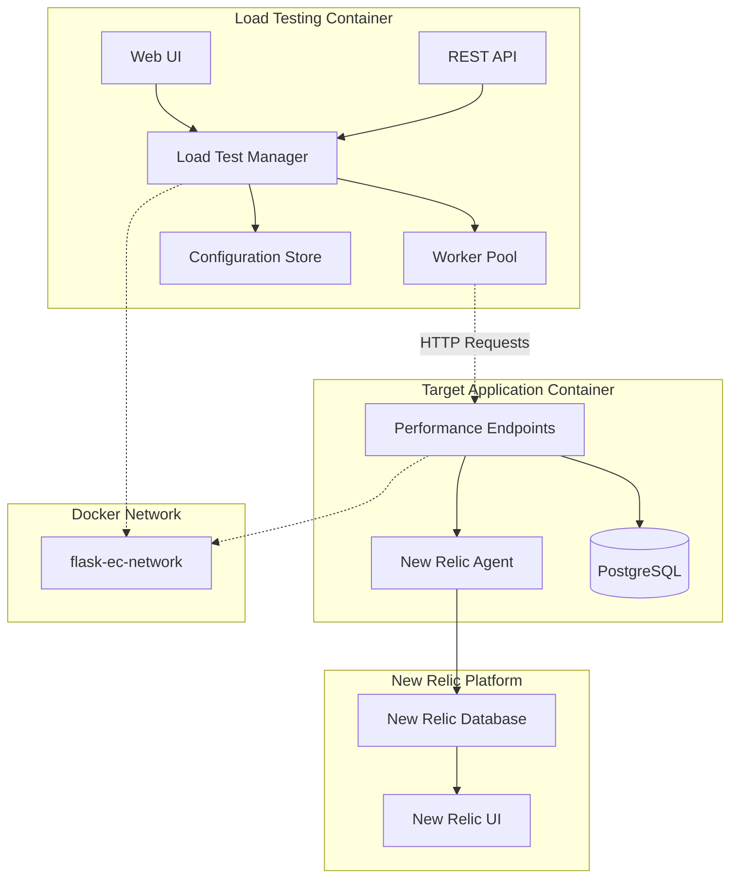

# 設計書

## 概要

負荷テスト自動化機能は、既存のFlask ECアプリケーションに統合される形で実装され、パフォーマンス問題エンドポイントに対して継続的な負荷を生成します。この機能により、New Relicでの監視データの継続的な生成と、実際の負荷状況下でのアプリケーションの動作確認が可能になります。

## アーキテクチャ

### システム構成



### デプロイメント戦略

#### 1. 独立コンテナ構成
- **負荷テストコンテナ**: 完全に独立したPythonアプリケーション
- **ターゲットアプリケーション**: 既存のFlask ECアプリケーション（無変更）
- **ネットワーク分離**: Docker networkによる適切な分離
- **データベース分離**: 負荷テスト用の独立したSQLiteデータベース

#### 2. コンテナ間通信
- **HTTP通信のみ**: 負荷テストコンテナからターゲットアプリへのHTTPリクエストのみ
- **ポート公開**: 負荷テスト管理UI用の独立ポート（例：8080）
- **ログ共有**: Docker volumeによるログファイル共有（オプション）

### コンポーネント設計

#### 1. Load Test Manager (負荷テスト管理)
- **責任**: 負荷テストの開始、停止、監視
- **機能**: 
  - ワーカープールの管理
  - テスト設定の適用
  - リアルタイム状態監視
  - 緊急停止機能

#### 2. Worker Pool (ワーカープール)
- **責任**: 並行リクエストの実行
- **機能**:
  - 設定可能な同時接続数
  - エンドポイントのランダム選択
  - リクエスト間隔の制御
  - 基本的なエラーハンドリング

#### 3. Configuration Store (設定管理)
- **責任**: 負荷テスト設定の永続化
- **機能**:
  - 設定値の検証
  - デフォルト値の管理
  - 設定変更の履歴

## コンポーネントと インターフェース

### 1. Load Test Manager

```python
class LoadTestManager:
    def start_test(self, config: LoadTestConfig) -> TestSession
    def stop_test(self, session_id: str) -> bool
    def get_status(self, session_id: str) -> TestStatus
    def emergency_stop(self) -> bool
    def get_active_sessions(self) -> List[TestSession]
```

### 2. Worker Pool

```python
class WorkerPool:
    def __init__(self, max_workers: int)
    def start_workers(self, config: LoadTestConfig) -> None
    def stop_workers(self) -> None
    def get_worker_status(self) -> List[WorkerStatus]
    def adjust_worker_count(self, count: int) -> None
```

### 3. Endpoint Selector

```python
class EndpointSelector:
    def __init__(self, endpoints: Dict[str, EndpointConfig])
    def select_endpoint(self) -> EndpointConfig
    def update_weights(self, weights: Dict[str, float]) -> None
    def get_endpoint_stats(self) -> Dict[str, EndpointStats]
```

### 4. 追加パフォーマンステストエンドポイント

新しい要件に基づき、以下の追加エンドポイントが負荷テスト対象に含まれます：

#### 4.1 一般エラーエンドポイント
- **URL**: `/performance/error`
- **目的**: 一般的なアプリケーションエラーの生成と監視
- **期待される動作**: 様々なタイプのエラー（500エラー、例外など）を発生させる

#### 4.2 フルテーブルスキャンエンドポイント
- **URL**: `/performance/slow-query/full-scan`
- **目的**: データベースのフルテーブルスキャンによる性能問題の再現
- **期待される動作**: インデックスを使用しないクエリを実行し、大量のデータをスキャン

#### 4.3 複雑結合クエリエンドポイント
- **URL**: `/performance/slow-query/complex-join`
- **目的**: 複数テーブルの複雑な結合による性能問題の再現
- **期待される動作**: 最適化されていない複雑なJOINクエリを実行

これらのエンドポイントは既存のエンドポイント選択ロジックに統合され、重み付きランダム選択の対象となります。


## データモデル

### 1. Load Test Configuration

```python
@dataclass
class LoadTestConfig:
    session_name: str
    concurrent_users: int = 10
    duration_minutes: int = 30
    request_interval_min: float = 1.0
    request_interval_max: float = 5.0
    endpoint_weights: Dict[str, float] = field(default_factory=dict)
    max_errors_per_minute: int = 100
    enable_logging: bool = True
```

### 2. Test Session

```python
@dataclass
class TestSession:
    id: str
    config: LoadTestConfig
    status: TestStatus
    start_time: datetime
    end_time: Optional[datetime]
```

### 3. Endpoint Configuration

```python
@dataclass
class EndpointConfig:
    name: str
    url: str
    method: str = "GET"
    weight: float = 1.0
    timeout: int = 30
    description: str = ""
```

## エラーハンドリング

### 1. エラー分類

- **Network Errors**: 接続タイムアウト、DNS解決失敗
- **HTTP Errors**: 4xx, 5xx レスポンス
- **Application Errors**: 予期しない例外
- **Resource Errors**: メモリ不足、CPU過負荷

### 2. エラー対応戦略

```python
class ErrorHandler:
    def handle_network_error(self, error: NetworkError) -> ErrorAction
    def handle_http_error(self, response: HTTPResponse) -> ErrorAction
    def handle_resource_error(self, error: ResourceError) -> ErrorAction
    def should_continue_test(self, error_rate: float) -> bool
```

### 3. 自動回復機能

- **Circuit Breaker**: 連続エラー時の一時停止
- **Backoff Strategy**: エラー後の待機時間調整
- **Load Reduction**: 高エラー率時の負荷軽減

## テスト戦略

### 1. 単体テスト

- **Manager Components**: 各管理コンポーネントの独立テスト
- **Worker Logic**: ワーカーの動作ロジック検証
- **Statistics Calculation**: 統計計算の正確性確認
- **Configuration Validation**: 設定値検証ロジック

### 2. 統合テスト

- **End-to-End Flow**: 完全な負荷テストフローの検証
- **Error Scenarios**: エラー状況での動作確認
- **Performance Under Load**: 負荷テスト機能自体の性能確認
- **Database Integration**: データベース操作の整合性確認

### 3. 負荷テスト

- **Self-Testing**: 負荷テスト機能の自己負荷テスト
- **Resource Monitoring**: システムリソース使用量の監視
- **Scalability Testing**: 同時接続数増加時の動作確認

## セキュリティ考慮事項

### 1. アクセス制御

- **Authentication**: 管理画面へのアクセス認証
- **Authorization**: 機能レベルでの権限制御
- **Rate Limiting**: API呼び出し頻度制限

### 2. リソース保護

- **Resource Limits**: CPU、メモリ使用量の上限設定
- **Connection Limits**: 最大同時接続数の制限
- **Timeout Controls**: 各種タイムアウト値の適切な設定

### 3. ログセキュリティ

- **Sensitive Data Filtering**: 機密情報のログ除外
- **Log Rotation**: ログファイルの自動ローテーション
- **Access Logging**: 管理操作のアクセスログ

## パフォーマンス最適化

### 1. 非同期処理

```python
# asyncio を使用した非同期リクエスト処理
async def execute_load_test(config: LoadTestConfig):
    async with aiohttp.ClientSession() as session:
        tasks = []
        for _ in range(config.concurrent_users):
            task = asyncio.create_task(worker_loop(session, config))
            tasks.append(task)
        await asyncio.gather(*tasks)
```

### 2. メモリ効率化

- **Streaming Statistics**: 大量データのストリーミング処理
- **Circular Buffers**: 固定サイズバッファでのメモリ使用量制御
- **Lazy Loading**: 必要時のみデータロード

### 3. データベース最適化

- **Batch Operations**: バッチでのデータベース操作
- **Connection Pooling**: データベース接続プールの活用
- **Index Optimization**: 統計クエリ用インデックスの最適化

## 監視とアラート

### 1. New Relic での監視

- **APM Metrics**: リクエスト処理時間、スループット、エラー率
- **Browser Monitoring**: Core Web Vitals、JavaScriptエラー
- **Infrastructure**: CPU、メモリ、ネットワーク使用量
- **Database**: クエリ性能、スロークエリ検出

### 2. 負荷テスト管理UI

- **基本ステータス**: 実行中/停止中の状態表示
- **設定管理**: 負荷テストパラメータの設定
- **簡単な統計**: 送信済みリクエスト数、実行時間
- **エラーログ**: 負荷テスト自体のエラー表示

### 3. New Relic ダッシュボード活用

- **カスタムダッシュボード**: 負荷テスト期間中の専用ビュー
- **アラート設定**: 異常値検出時の通知
- **トレンド分析**: 継続的な負荷での性能変化

## デプロイメント考慮事項

### 1. Docker構成

#### docker-compose.yml 拡張
```yaml
version: '3.8'
services:
  # 既存のアプリケーション（変更なし）
  app:
    build: .
    ports:
      - "5001:5000"
    networks:
      - flask-ec-network
  
  postgres:
    image: postgres:13
    networks:
      - flask-ec-network
  
  # 新規：負荷テストサービス
  load-tester:
    build: ./load-tester
    ports:
      - "8080:8080"  # 管理UI用ポート
    environment:
      - TARGET_APP_URL=http://app:5000
      - LOG_LEVEL=INFO
    volumes:
      - ./logs:/app/logs
      - load-test-data:/app/data
    networks:
      - flask-ec-network
    depends_on:
      - app

networks:
  flask-ec-network:
    driver: bridge

volumes:
  load-test-data:
```

### 2. 独立性の保証

- **プロセス分離**: 完全に独立したPythonプロセス
- **リソース制限**: Docker resource limitsによる制限
- **データベース分離**: SQLiteによる独立したデータストレージ
- **ログ分離**: 独立したログファイルとローテーション

### 3. 設定管理

- **Environment Variables**: ターゲットアプリケーションURL等の外部化
- **Configuration Files**: 負荷テスト固有の設定ファイル
- **Runtime Configuration**: Web UI経由での実行時設定変更

### 4. 影響最小化

- **Zero Code Changes**: 既存アプリケーションのコード変更なし
- **Independent Lifecycle**: 負荷テストコンテナの独立した起動・停止
- **Resource Isolation**: CPU・メモリ使用量の制限
- **Network Isolation**: 必要最小限の通信のみ許可
#
# 技術スタック（負荷テストコンテナ）

### Backend
- **Framework**: FastAPI（高性能なAPI開発）
- **HTTP Client**: aiohttp（非同期HTTPクライアント）
- **Configuration**: JSON/YAML設定ファイル
- **Task Queue**: asyncio（非同期タスク処理）
- **Logging**: Python logging（基本ログ出力）

### Frontend
- **UI Framework**: 軽量なHTML/CSS/JavaScript
- **Real-time Updates**: Server-Sent Events（シンプルな更新）
- **Styling**: Bootstrap（レスポンシブUI）

### Infrastructure
- **Container**: Docker（独立デプロイメント）
- **Process Management**: uvicorn（ASGI server）
- **Configuration**: pydantic-settings（設定管理）
- **Health Checks**: Docker health checks

## 既存システムへの影響分析

### 1. 影響なし（Zero Impact）
- **アプリケーションコード**: 一切の変更不要
- **データベーススキーマ**: 既存DBへの変更なし
- **デプロイメント**: 既存のデプロイプロセス変更なし
- **依存関係**: 新しいライブラリ追加なし

### 2. 最小限の影響（Minimal Impact）
- **docker-compose.yml**: 新しいサービス追加のみ
- **ネットワーク負荷**: HTTP リクエストによる負荷（制御可能）
- **ログボリューム**: New Relicログの増加（監視目的）

### 3. 利点（Benefits）
- **監視データ**: 継続的なNew Relicデータ生成
- **パフォーマンステスト**: 実際の負荷での動作確認
- **問題検出**: 潜在的な問題の早期発見
- **開発効率**: 自動化された負荷テスト環境