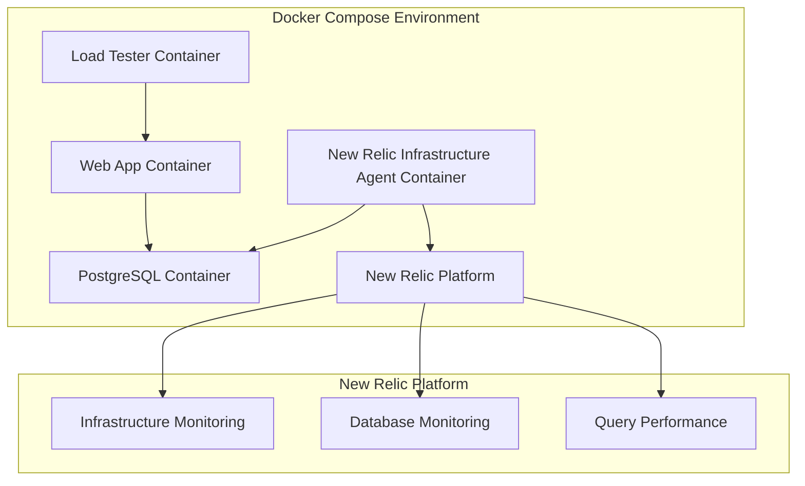

# 設計書

## 概要

New Relic Infrastructure AgentをDocker Composeの独立したサービスとして追加し、PostgreSQL On-Host IntegrationとQuery Performance Monitoringを実現します。既存のアプリケーションやデータベース設定を変更せず、非侵入的な監視を提供します。

## アーキテクチャ

### 全体構成



### コンテナ間通信

- Infrastructure Agentコンテナは、PostgreSQLコンテナに直接接続
- 既存のflask-ec-networkを使用してネットワーク通信
- PostgreSQLの既存ポート（5432）を使用
- 既存のアプリケーションフローに影響なし

## コンポーネントと インターフェース

### 1. New Relic Infrastructure Agent Container

**ベースイメージ**: `newrelic/infrastructure:latest`

**主要機能**:
- New Relic Infrastructure Agentの実行
- PostgreSQL On-Host Integrationの設定と実行
- メトリクス収集とNew Relicへの送信

**設定ファイル**:
- `/etc/newrelic-infra.yml`: Infrastructure Agent基本設定
- `/etc/newrelic-infra/integrations.d/postgresql-config.yml`: PostgreSQL統合設定

### 2. PostgreSQL Integration Configuration

**接続設定**:
```yaml
integrations:
  - name: nri-postgresql
    config:
      hostname: postgres
      port: 5432
      username: postgres
      password: postgres
      database: ecdb
      collection_list: 'ALL'
      collect_db_lock_metrics: true
      collect_bloat_metrics: true
```

**Query Performance Monitoring設定**:
```yaml
query_performance_monitoring:
  enabled: true
  collection_interval: 60s
  max_query_length: 4096
```

### 3. 環境変数インターフェース

**必須環境変数**:
- `NRIA_LICENSE_KEY`: New Relicライセンスキー
- `NRIA_DISPLAY_NAME`: エージェント表示名
- `POSTGRES_HOST`: PostgreSQLホスト名（デフォルト: postgres）
- `POSTGRES_PORT`: PostgreSQLポート（デフォルト: 5432）
- `POSTGRES_USER`: PostgreSQLユーザー名
- `POSTGRES_PASSWORD`: PostgreSQLパスワード
- `POSTGRES_DATABASE`: データベース名

## データモデル

### New Relic PostgreSQL Integrationによる標準メトリクス収集

**Infrastructure AgentのPostgreSQL統合が自動収集するメトリクス**:

**データベースレベル**:
- 接続数（pg_stat_database）
- トランザクション数（コミット、ロールバック）
- データベースサイズ（pg_database_size）
- バックエンドプロセス数

**テーブルレベル**:
- テーブルサイズ（pg_relation_size）
- 行数推定（pg_class.reltuples）
- インデックス使用統計（pg_stat_user_indexes）
- Vacuum/Analyze統計（pg_stat_user_tables）

**Query Performance Monitoring**（pg_stat_statementsが有効な場合）:
- クエリ実行統計
- 実行時間分布
- 実行回数
- I/O統計

### New Relicでのデータ表現

**メトリクス送信先**: New Relic Infrastructure（PostgreSQLSampleイベント）

**エンティティ識別**:
```yaml
entity:
  name: "postgres:5432"
  type: "PostgreSQL"
  displayName: "Flask-EC-PostgreSQL"
```

**注意**: すべてのメトリクスはNew Relic Infrastructure AgentのPostgreSQL統合により自動収集され、カスタムデータ収集ロジックは実装しません。

## エラーハンドリング

### 接続エラー

**PostgreSQL接続失敗**:
- 再試行ロジック（最大3回、30秒間隔）
- 接続失敗時のログ出力
- New Relicへのエラーメトリクス送信

**設定エラー**:
- 環境変数不足時の明確なエラーメッセージ
- 設定ファイル検証
- 起動前の設定チェック

### 監視継続性

**部分的障害対応**:
- PostgreSQL一時停止時の自動復旧
- メトリクス収集失敗時の継続動作
- New Relic送信失敗時のローカルバッファリング

## テスト戦略

### 統合テスト

**接続テスト**:
- PostgreSQLへの接続確認
- メトリクス収集の動作確認
- New Relicへのデータ送信確認

**設定テスト**:
- 環境変数による設定変更テスト
- 設定ファイルの妥当性検証
- エラー条件でのエラーハンドリングテスト

### 監視テスト

**メトリクス精度テスト**:
- 収集されるメトリクスの精度確認
- New Relicダッシュボードでのデータ表示確認
- Query Performance Monitoringの動作確認

**パフォーマンステスト**:
- Infrastructure Agentのリソース使用量測定
- 既存アプリケーションへの影響測定
- 大量データ処理時の安定性確認

## セキュリティ考慮事項

### 認証情報管理

**環境変数による管理**:
- データベース認証情報の環境変数化
- New Relicライセンスキーの安全な管理
- 本番環境での秘密情報の適切な管理

**ネットワークセキュリティ**:
- コンテナ間通信の制限
- 不要なポート公開の回避
- Docker networkによる分離

### データプライバシー

**クエリデータ**:
- 機密データを含むクエリの除外設定
- クエリ長制限による情報漏洩防止
- 個人情報を含むテーブルの監視除外オプション

## 実装詳細

### Docker Compose設定

**新サービス追加**:
```yaml
newrelic-infra:
  image: newrelic/infrastructure:latest
  container_name: flask-ec-newrelic-infra
  environment:
    - NRIA_LICENSE_KEY=${NEW_RELIC_LICENSE_KEY}
    - NRIA_DISPLAY_NAME=Flask-EC-Infrastructure
  volumes:
    - ./newrelic/newrelic-infra.yml:/etc/newrelic-infra.yml:ro
    - ./newrelic/postgresql-config.yml:/etc/newrelic-infra/integrations.d/postgresql-config.yml:ro
  depends_on:
    postgres:
      condition: service_healthy
  networks:
    - flask-ec-network
```

### 設定ファイル構造

```
newrelic/
├── newrelic-infra.yml          # Infrastructure Agent基本設定
├── postgresql-config.yml       # PostgreSQL統合設定
└── README.md                   # 設定説明書
```

### 起動順序

1. PostgreSQLコンテナの起動と健全性確認
2. Infrastructure Agentコンテナの起動
3. PostgreSQL統合の初期化
4. メトリクス収集開始
5. New Relicへのデータ送信開始